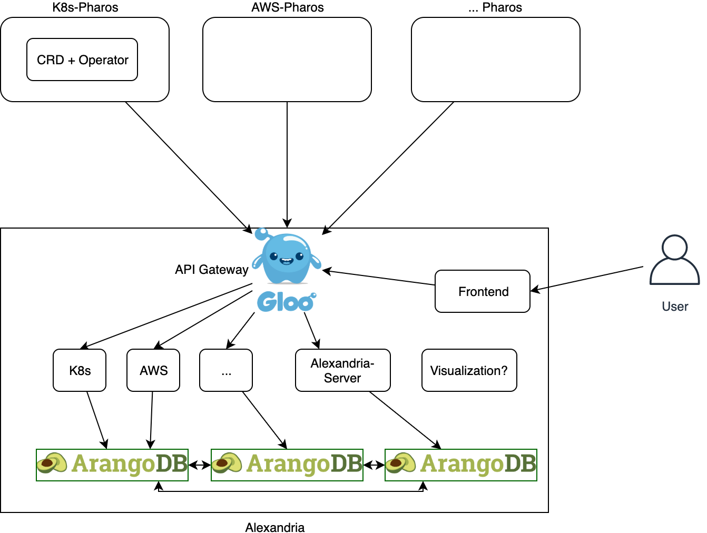
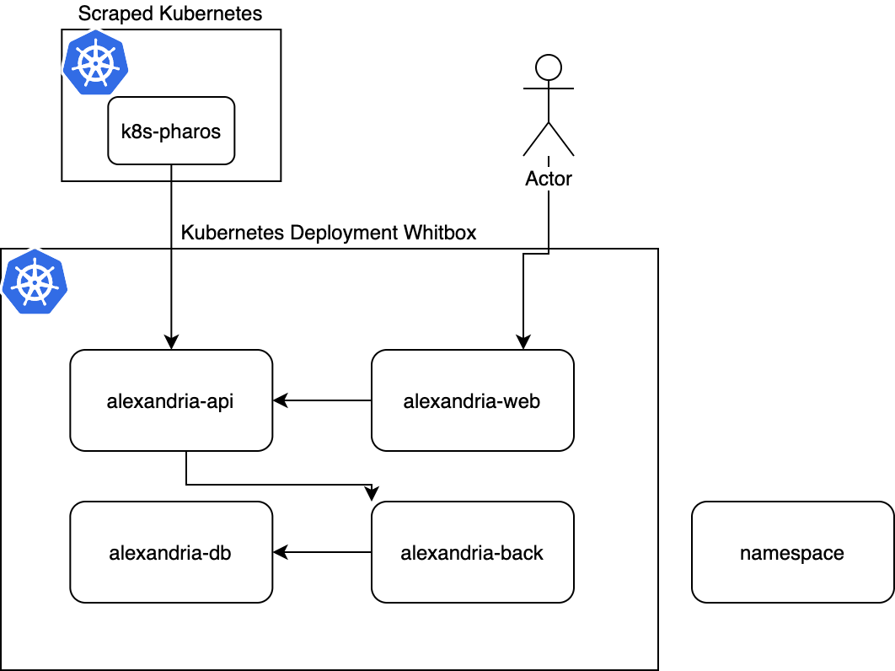
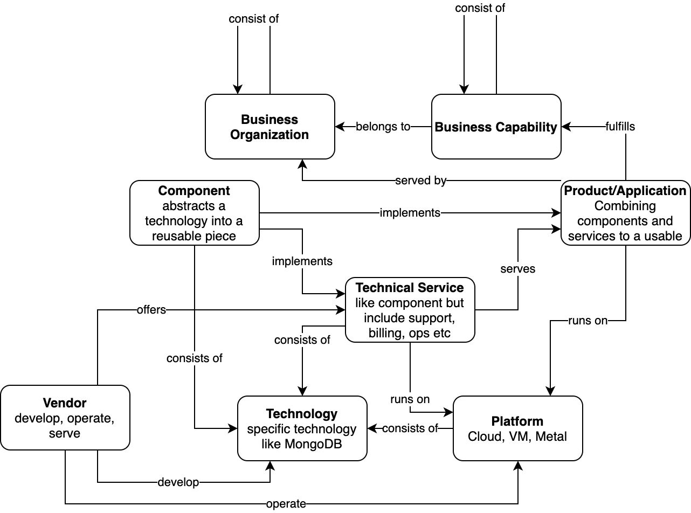

# Documentation
The idea is to develop a next generation open source enterprise architecture management solution. Nether the way of how EAM is done nowadays nor the tools at the market fit to the speed of technology evolving. 

The system consist of two major components: 
* Alexandria: like the lost library, it builds the central component with a flexible meta model and an adaptable architecture in mind.
* Pharos: It's not a single component, there will be multiple Pharos for each platform one, like for AWS, Kubernetes and so on.

## Alexandria
The following diagram was just for a initial idea thrown together:

### Namespaces & Network Policies
The data we collect are normaly not sensitive, however we decided that we will seperate the differnt functions in group them via namespaces. Furthermore we will deliver network policies to regulate which service can talk with what.

## Pharos
### Kubernetes

### AWS

### GCP

### Azure

# Enterprise Architecture Management
## XXX

## Metamodel
The meta model is flexibel and can be changed by the user. Howevery, we preload Alexandira with the following meta model:
